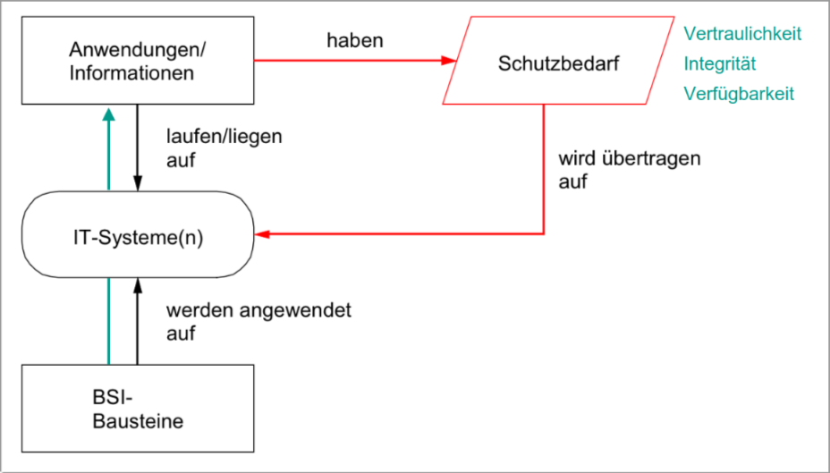
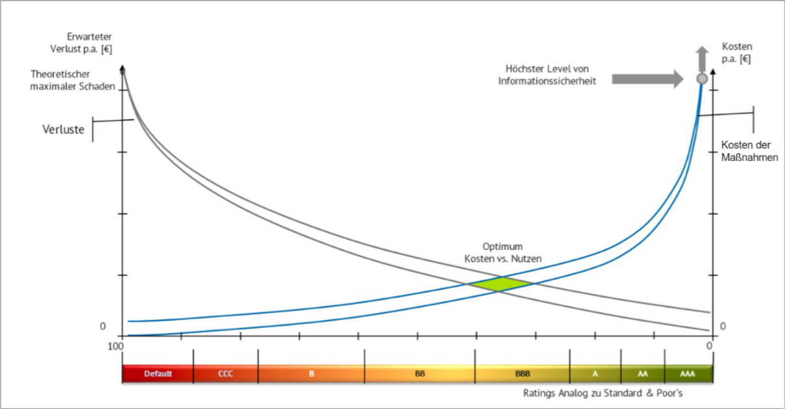
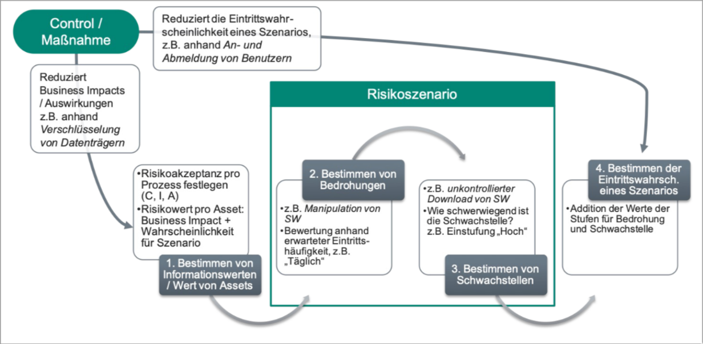

# Managementaufgaben

## Governance, Risk & Compliance Management (GRC)

> Privacy by Design: Datenschutzfreundliche Voreinstellungen

### IT Governance

Corporate Governance
    - Unternehmensführung
    - Ordnungsrahmen für Leitung und Überwachung von Unternehmen
    - Aufsichtsrat und Unternehmensführung verantworten Umsetzung

|  
|  
V  

IT Governance
    - besteht aus Führung, Organisationsstrukturen und Prozessen
    - zuständig für die Unterstützung der Unternehmensstrategie mit IT

|  
|  
V  

Standards und Rahmenwerk

### Ganzheitliche Risiko-Betrachtung

### Compliance-Vorgaben

- Unternehmensinterne Regelwerke -> z.B. Richtlinien, Hausstandards
- Unternehmensexterne Regelwerke -> z.B. Normen, Branchenstandards
- Rechtliche Vorgaben -> z.B. Gesetze, Verträge

### Wesentliche gesetzliche Regelungen

- Datenschutz-Grundverordnung (DSGVO)
- Buchführung & Archivierungsvorschriften (GoBD)
- Risikomanagementregelungen (KonTraG)

### IT-Governance und Risikomanagement als Managementaufgabe

1. Risiken und Maßnahmenfestlegungen
1. Wirksamkeit und Aktualität prüfen
1. Risikokontrolle

## Schutzbedarfsanalyse und Risikomanagement

### Bestimmung von Informationswerten

Vertraulichkeit:
    - Öffentlich
    - Externer Gebrauch
    - Interner Gebrauch
    - Vertraulich
Integrität (Unversehrtheit):
    - keine
    - Normal
    - Hoch
Verfügbarkeit:
    - Basis
    - Normal
    - Hoch
    - Sehr hoch
    - Außergewöhnlich

### Begriffe

- Schwachstelle: Verwundbarer Punkt in einem System
- Bedrohung: Verlust der Authentizität, Integrität, Verfügbarkeit durch ausnutzen einer Schwachstelle
- Risikoszenario oder Gefährdung liegt vor wenn eine Schwachstelle auf eine Bedrohung trifft

> Risikohöhe bemisst sich nach Eintrittswahrscheinlichkeit multipliziert mit der potenziellen Schadenhöhe
{.is-info}

### Risikoakzeptanz

### Bedrohungsmodellierung (STRIDE)

- Erkennung von Bedrohungen für ein System
- Aufschlüsselung von Datenflüssen

Kategorien:

- Spoofing -> Identitätsverschleierung
- Tampering -> Bruch der Integrität
- Repudiation -> Abstreitbarkeit
- Information Disclosure -> Informationspreisgabe
- Denial of Service -> Dienstverweigerung
- Elevation of Privilege -> Privilegienerhöhung

### Prozesse der IT-Sicherheit

Aspekte:

- Informationssysteme
- Sicherheitsanforderungen
- SSLA (Security Service Level Agreements)
- Sicherheitsfreigabe
- Change-Management

1. Entwicklung -> z. B. Unternehmensweite Sicherheitspolitik, Risikoanalyse, IT-Sicherheitskonzept
1. Umsetzung -> z. B. Implementierung, Durchführung von Sensibilisierungs- und Schulungsmaßnahmen, Test der Sicherheitsmaßnahmen
1. Betrieb -> z. B. Aufrechterhaltung des Sicherheitsniveaus, Change-Management, Reaktion auf sicherheitsrelevante Ereignissed

### Risikomanagement

1. Initialisierung
1. Identifizierung
1. Beurteilung
1. Steuerung
1. Überwachung

