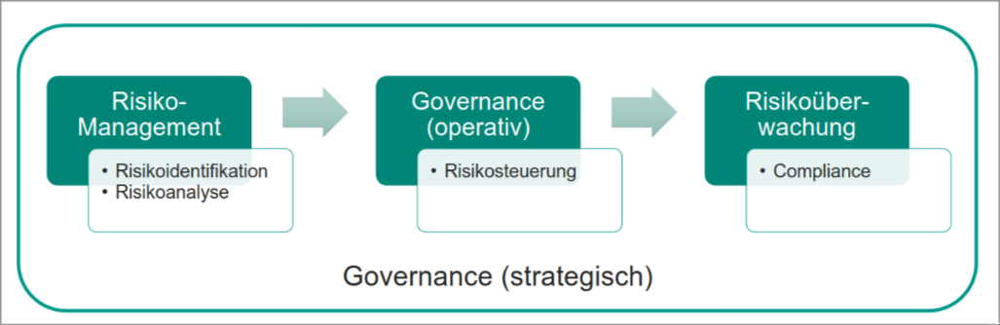

# Managementaufgaben

## Governance, Risk & Compliance Management (GRC)

> Privacy by Design: Datenschutzfreundliche Voreinstellungen

### IT Governance

Corporate Governance
    - Unternehmensführung
    - Ordnungsrahmen für Leitung und Überwachung von Unternehmen
    - Aufsichtsrat und Unternehmensführung verantworten Umsetzung

|  
|  
V  

IT Governance
    - besteht aus Führung, Organisationsstrukturen und Prozessen
    - zuständig für die Unterstützung der Unternehmensstrategie mit IT

|  
|  
V  

Standards und Rahmenwerk

### Ganzheitliche Risiko-Betrachtung

### Compliance-Vorgaben

- Unternehmensinterne Regelwerke -> z.B. Richtlinien, Hausstandards
- Unternehmensexterne Regelwerke -> z.B. Normen, Branchenstandards
- Rechtliche Vorgaben -> z.B. Gesetze, Verträge

### Wesentliche gesetzliche Regelungen

- Datenschutz-Grundverordnung (DSGVO)
- Buchführung & Archivierungsvorschriften (GoBD)
- Risikomanagementregelungen (KonTraG)

### IT-Governance und Risikomanagement als Managementaufgabe

1. Risiken und Maßnahmenfestlegungen
1. Wirksamkeit und Aktualität prüfen
1. Risikokontrolle

## ISMS/DSMS
