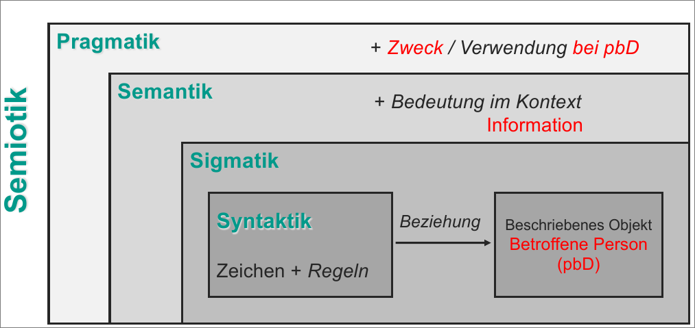
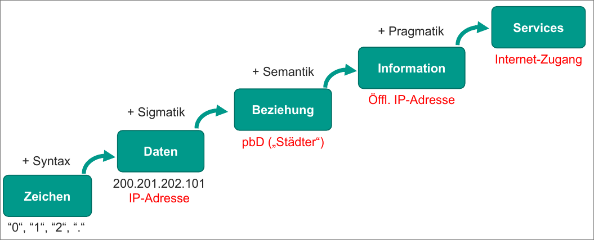

# Ausgangslage und Herausforderungen

## Daten

- Werte und Befunde über Dinge, Ereignisse und Zustände,
- durch Beobachtung und Messung ermittelt
- durch Formulierung technisch festgehalten

Datenarten:

- Persönliche Daten
  - beziehen sich auf natürliche Personen
- Technische Daten
  - beziehen sich auf eine Sache
  - kann auch personenbezogenbezug haben

- Anonymisierte Daten
  - frei zugänglich
  <!--TODO - Rückfrage pseunonymität -->

