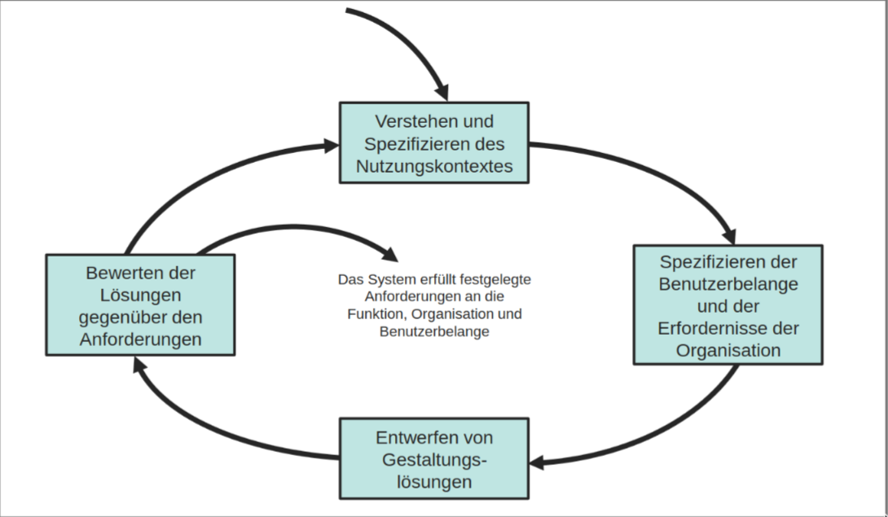

# Vorgehensmodelle

## User-Centered Design (Human-Centered Design)

1. Verstehen und Spezifizieren des Nutzungskontextes

- Merkmale der Benutzer (z.B. Sprache, Vorwissen)
- Ziele & Aufgaben
- Digitale Umgebung (Hard- & Software)
- Soziale & Physische Umgebung

> Durchführung mit Empirischen Methoden (z.B. Interviews, Beobachtungen, Fragebögen)
{.is-info}

2. Festlegen der Benutzerbelange und der Erfordernisse

- Leistung im Bezug auf betriebliche & finanzielle Ziele
- Vorschriften & Gesetze
- Zusammenarbeit mit anderen Systemen
- Durchführbarkeit von Betrieb & Wartung (z.B. SLA, Alternativen)

3. Entwerfen von Gestaltungslösungen

- Verwenden des Wissens aus Ergonomie, Psychologie, ...
- Konkretisierung von Gestaltungslösungen mit Pseudoimplementierungen (z.B. Prototypen, Mockups)
- Wiederholung des Prozesses bis Zufriedenheit

4. Bewerten der Lösungen gegenüber den Anforderungen

Ziele:

- Rückkopplung für die Gestaltung
- Zielerreichung überprüfen
- Überwachung der Langzeitnutzung

Plan für die Bewertung -> Erfolgskriterien, Kennzahlen, Methoden

### Vorteile

- Frühzeitige Einbeziehung der Benutzer führt zu besserer Erfüllung der Bedürfnisse
- Reduzierung von Fehlern und Vermeidung von Feature-Creep
- durch den Kontakt zwischen Entwickler und Benutzer verstärkt sich Empathie
- durch die umfassende Betrachtung der Zielgruppe wird das Verständnis für die Vielseitigkeit verstärkt
- bietet genug Struktur für kleine Teams
- kann als Kriterienkatalog für andere Vorgehensmodelle dienen

### Nachteile

- Fokus auf den Benutzer kann dazu führen dass Kreativität und Innovationen vernachlässigt werden
- nicht benutzerzentriert

## Contextual Design

- Weiterentwicklung von UCD
- Kundenzentrierter Font-End-Designprozess

Zentrale Fragen:

- Was sit bei der Arbeit wichtig?
- Wie soll das neue System genutzt werden?
- Wie soll das neue System strukturiert sein?
- Bauen wir das richtige System?

### Ablauf

Analyse:

1. Kontext-Erkundung -> Daten sammeln durch Beobachten und Befragen von Kunden während der Arbeit
1. Interpretations-Session & Arbeitsmodellierung -> Kernpunkte herausarbeiten
1. Konsolidierung -> Zusammenführen der Modelle zu Analyse-Resultat

Gestaltung:

1. Neugestaltung der Arbeit -> Darstellung durch Vision & Storyboards
1. Design der Benutzerumgebung -> Strukturierung der Benutzerumgebung (ohne Implementierung, ausblenden von technischen Hürden)
1. Paper-Prototyping -> Testen der Gestaltung mit Benutzern

### Vorteile

- ???
- Profit

### Nachteile

- Lagzeitorientiert: wenig tolerant für Richtungsänderungen
- Fokus auf existierende Büroarbeit
- Auf große Teams ausgelegt
- Kann nicht mit Remote-Work umgehen

## Participatory Design

- Weiterentwicklung von UCD
- Stakeholder werden allen (auch in späteren) Phasen einbezogen
- Nutzer legen Ziele fest

### Prinzipien

1. Nutzer, Designer und Programmierer sind gleichberechtigte Partner.
1. Kontinuierliche Kommunikation zwischen Stakeholdern beschleunigt Gestaltungsprozesse.
1. Jede Rolle (Nutzer, Projektleiter, Designer, Programmierer) bringt ein eigenes, unersetzliches Verständnis der Problemstellung mit.
1. Gemeinsames Schaffen fördert gemeinsame Verantwortung

### Vorteile

- tiefes Verständnis der Nutzerbedürfnisse
- detailierte Passung zum Nutzungskontext
- kürzere Feedbackschleifen
- höhere Akzeptanz der Lösung

### Nachteile

- hoher Aufwand
- langsam
- geprägt von Kompromissen
- unerfüllbare Erwartungen (z.B. erfüllen aller Nutzerwünsche)

## Anforderungsanalyse

- Contextual Inquiry
- Diary Study
- Personas
